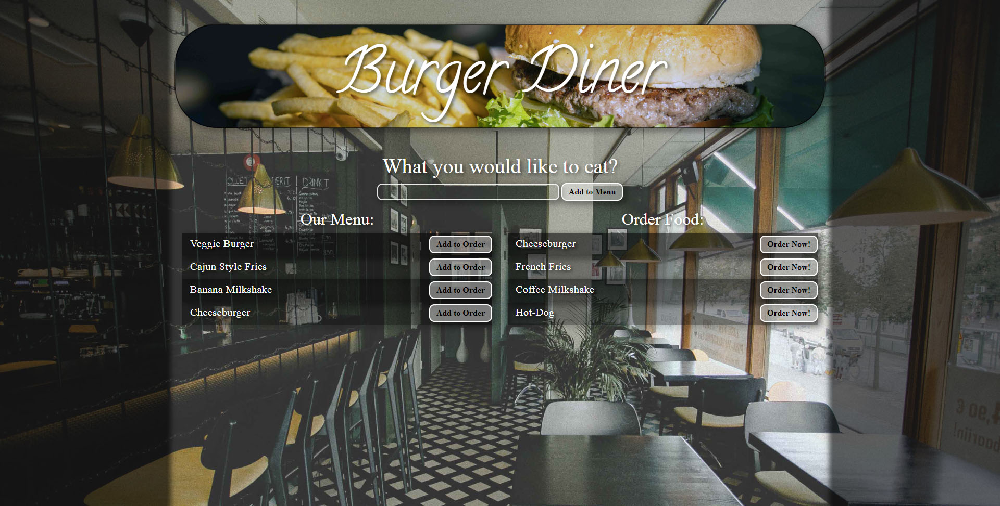

# Burger

**Burger-Diner**

**Unit 14: Handlebars Assignment**

**Burger-Diner** is a restaurant app that lets users input the names of burgers they'd like to eat. Whenever a user submits a burger's name, app will display the burger on the left side of the page - waiting to be ordered. Each burger in the waiting area also has a Add to Order! button. When the user clicks it, the burger will move to the right side of the page. App will store every burger in a database, whether Ordered it or not.

Link to Github Deployment:

https://guarded-inlet-83422.herokuapp.com/

**Languages & Technologies used:**
MySQL, Node, Express, Handlebars, HTML, CSS, Javascript, Jquery 
